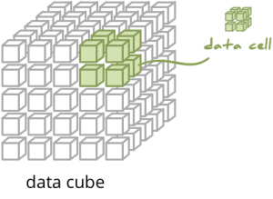
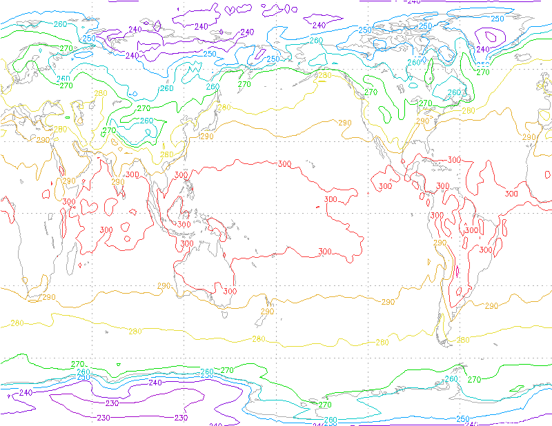
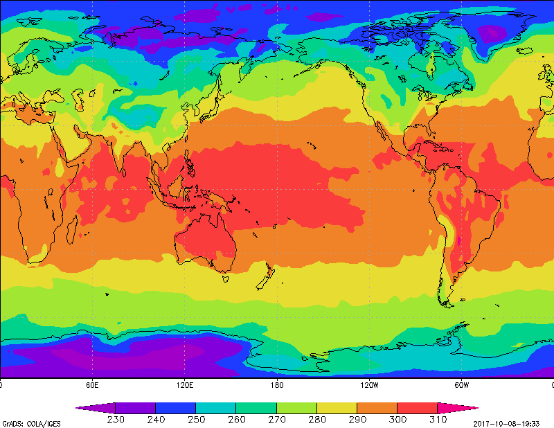

# NetCDF (_Network Common Data Form_)

> Vamos usar o arquivo [test_echam_spectral-deflated.nc](https://www.unidata.ucar.edu/software/netcdf/examples/test_echam_spectral-deflated.nc)

NetCDF é um formato de arquivo em que os dados estão salvos em matrizes.



Hoje vamos acessar algumas informações de arquivos NetCDF, que vamos chamar carinhosamente de **nc** :)
> Caso queira praticar os comandos que vamos mostrar pode instalar as [ferramentas](#ferramentas) ;)

### CDO (_Climate Data Operators_)

São operadores usados para aplicar operações em arquivos **nc**.

#### Lendo informações do seu nc

```bash
▶ cdo showvar test_echam_spectral-deflated.nc
 abso4 aclcac aclcov ahfcon ahfice ahfl ahfliac ahfllac ahflwac ahfres ahfs ahfsiac ahfslac ahfswac albedo albedo_nir albedo_nir_dif albedo_nir_dir albedo_vis albedo_vis_dif albedo_vis_dir alsobs alsoi alsol alsom alsow ameltdepth ameltfrac amlcorac ao3 apmeb apmegl aprc aprl aprs aps az0i az0l az0w barefrac dew2 drain evap evapiac evaplac evapwac fage friac geosp glac gld lsp q qres qvi relhum runoff sd seaice siced sicepdi sicepdw sicepres slm sn snacl snc sni snifrac snmel sofliac sofllac soflwac srad0 srad0d srad0u sradl srads sradsu sraf0 srafl srafs st svo t2max t2min temp2 thvsig topmax tpot trad0 tradl trads tradsu traf0 trafl trafs trfliac trfllac trflwac tropo tsi tsicepdi tslm1 tsurf tsw u10 ustr ustri ustrl ustrw v10 vdis vdisgw vstr vstri vstrl vstrw wimax wind10 wl ws wsmx xi xivi xl xlvi
cdo showname: Processed 127 variables ( 0.10s )

▶ cdo showname test_echam_spectral-deflated.nc  # Também mostra as variáveis do nc
 abso4 aclcac aclcov ahfcon ahfice ahfl ahfliac ahfllac ahflwac ahfres ahfs ahfsiac ahfslac ahfswac albedo albedo_nir albedo_nir_dif albedo_nir_dir albedo_vis albedo_vis_dif albedo_vis_dir alsobs alsoi alsol alsom alsow ameltdepth ameltfrac amlcorac ao3 apmeb apmegl aprc aprl aprs aps az0i az0l az0w barefrac dew2 drain evap evapiac evaplac evapwac fage friac geosp glac gld lsp q qres qvi relhum runoff sd seaice siced sicepdi sicepdw sicepres slm sn snacl snc sni snifrac snmel sofliac sofllac soflwac srad0 srad0d srad0u sradl srads sradsu sraf0 srafl srafs st svo t2max t2min temp2 thvsig topmax tpot trad0 tradl trads tradsu traf0 trafl trafs trfliac trfllac trflwac tropo tsi tsicepdi tslm1 tsurf tsw u10 ustr ustri ustrl ustrw v10 vdis vdisgw vstr vstri vstrl vstrw wimax wind10 wl ws wsmx xi xivi xl xlvi
cdo showname: Processed 127 variables ( 0.10s )

▶ cdo showtimestamp test_echam_spectral-deflated.nc  # Mostra todos os tempos do nc
  2003-12-01T00:00:00  2003-12-01T03:00:00  2003-12-01T06:00:00  2003-12-01T09:00:00  2003-12-01T12:00:00  2003-12-01T15:00:00  2003-12-01T18:00:00  2003-12-01T21:00:00
cdo showtimestamp: Processed 127 variables over 8 timesteps ( 0.09s )

▶ cdo showunit test_echam_spectral-deflated.nc  # Mostra as unidades de cada variável do nc
 kg/m**2 W/m**2 W/m**2 W/m**2 W/m**2 W/m**2 W/m**2 W/m**2 W/m**2 W/m**2 W/m**2 W/m**2 m W/m**2 kg/kg kg/m**2s kg/m**2s kg/m**2s kg/m**2s kg/m**2s Pa m m m K kg/m**2s kg/m**2s kg/m**2s kg/m**2s kg/m**2s m**2/s**2 m kg/kg W/m**2 kg/m**2 kg/m**2s 1/s m m m W/m**2 m kg/m**2s m m kg/m**2s W/m**2 W/m**2 W/m**2 W/m**2 W/m**2 W/m**2 W/m**2 W/m**2 W/m**2 W/m**2 W/m**2 W/m**2 K 1/s K K K K Pa K W/m**2 W/m**2 W/m**2 W/m**2 W/m**2 W/m**2 W/m**2 W/m**2 W/m**2 W/m**2 Pa K K K K K m/s Pa Pa Pa Pa m/s W/m**2 W/m**2 Pa Pa Pa Pa m/s m/s m m m kg/kg kg/m**2 kg/kg kg/m**2
cdo showunit: Processed 127 variables ( 0.09s )

▶ cdo showformat test_echam_spectral-deflated.nc  # Formato do nc
netCDF4 classic ZIP
cdo showformat: Processed 127 variables ( 0.08s )
```

#### Criando arquivos

> Os arquivos são criados partir de um ou mais arquivos de entrada ;)

Vamos recortar as variáveis de temperatura do arquivo **test_echam_spectral-deflated.nc** para **temp.nc**.

```bash
▶ cdo selvar,t2max,t2min,temp2 test_echam_spectral-deflated.nc temp.nc
cdo selname: Processed 442368 values from 127 variables over 8 timesteps ( 0.15s )
```

#### Separando as variáveis em arquivos diferentes.

```bash
▶ cdo selvar,temp2 temp.nc temp2.nc
cdo selname: Processed 147456 values from 3 variables over 8 timesteps ( 0.01s )

▶ cdo selvar,t2min temp.nc t2min.nc
cdo selname: Processed 147456 values from 3 variables over 8 timesteps ( 0.01s )

▶ cdo selvar,t2max temp.nc t2max.nc
cdo selname: Processed 147456 values from 3 variables over 8 timesteps ( 0.01s )

▶ cdo seltimestep,1 temp2.nc temp2_t1.nc  # Selecionando o timestep 1 [0]
cdo seltimestep: Processed 129024 values from 1 variable over 8 timesteps ( 0.02s )

▶ cdo seltimestep,2,8 temp2.nc temp2_t2_t8.nc  # Selecionado os timesteps 2 e 8 [[1], [7]]
cdo seltimestep: Processed 36864 values from 1 variable over 8 timesteps ( 0.00s )

▶ cdo seltimestep,2/8 temp2.nc temp2_t2_t8.nc  # Selecionado os timesteps de 2 a 8 [1:8]
cdo seltimestep: Processed 129024 values from 1 variable over 8 timesteps ( 0.02s )
```

#### Juntando os tempos e as variávies.

```bash
▶ cdo mergetime temp2_t1.nc temp2_t2_t8.nc temp_merged_time.nc  # Juntando os timesteps
cdo mergetime: Processed 147456 values from 2 variables over 8 timesteps ( 0.02s )

▶ cdo merge temp2.nc t2min.nc t2max.nc temp_merged_vars.nc  # Juntando as variáveis de temperatura
cdo merge: Processed 442368 values from 3 variables over 24 timesteps ( 0.02s )
```

### GrADS (_Grid Analysis and Display System_)

Um software usado para extrair dados de vários formatos, inclusive **nc**, para _plotar_ gráficos e mapas.

#### Abrindo os arquivos

```bash
sdfopen temp_merged_vars.nc
```

#### Consultando propriedades

```bash
q file  # Mostra os número de tempos e descrição da variáveis
q dims  # Descrição de cada dimensão
q vars  # Descrição das variáveis
```

#### Set plot area

```bash
set display color white
c
set parea 0 11 0 8.5
set mproj scaled
```

#### Plot Data!

```bash
d temp2
```



#### Barra de cores

> Baixar o arquivo [cbarn.gs](http://apdrc.soest.hawaii.edu/tutorials/cbarn.gs)

```bash
c
set parea 0 11 1 8.5
set mproj scaled
set gxout shaded
d temp2
run /path/to/cbarn.gs  # download ↑
```



#### O poder do **-t 0**

```bash
printim output/sem_transparencia.png
printim output/com_transparencia.png -t 0
```

### Python NetCDF4

Lib para extrair dados de arquivos **nc** e com suporte para NetCDF4 :)

#### 

```python
In [1]: from netCDF4 import Dataset

In [2]: dataset = Dataset('data/temp_merged_vars.nc')

In [3]: dataset['time'].units
Out[3]: 'days since 2002-12-1 00:00:00'

In [4]: dataset['temp2'][:] - 273.15  # Convertendo de K para °C
Out[4]: 
array([[[-32.56762695, -32.44239807, -32.38441467, ..., -33.05569458,
         -32.90483093, -32.70109558],
        [-29.90148926, -30.17010498, -30.2641449 , ..., -29.40301514,
         -29.55537415, -29.72964478],
        [-29.25827026, -29.36968994, -29.24783325, ..., -28.92048645,
         -29.12265015, -29.1716156 ],
        ..., 
        [-36.1051178 , -36.39863586, -37.02062988, ..., -35.83398438,
         -36.14558411, -35.74630737],
        [-38.43713379, -38.64866638, -39.0473938 , ..., -37.76054382,
         -38.02671814, -38.2412262 ],
        [-37.87698364, -37.91610718, -37.95526123, ..., -37.7578125 ,
         -37.79200745, -37.8341217 ]]], dtype=float32)


In [5]: dataset.close()
```

### Ferramentas

```bash
▶ sudo apt-get install cdo
▶ sudo apt-get install grads
▶ conda create --name py360 python=3.6
▶ source activate py360
▶ conda install netcdf4
```


